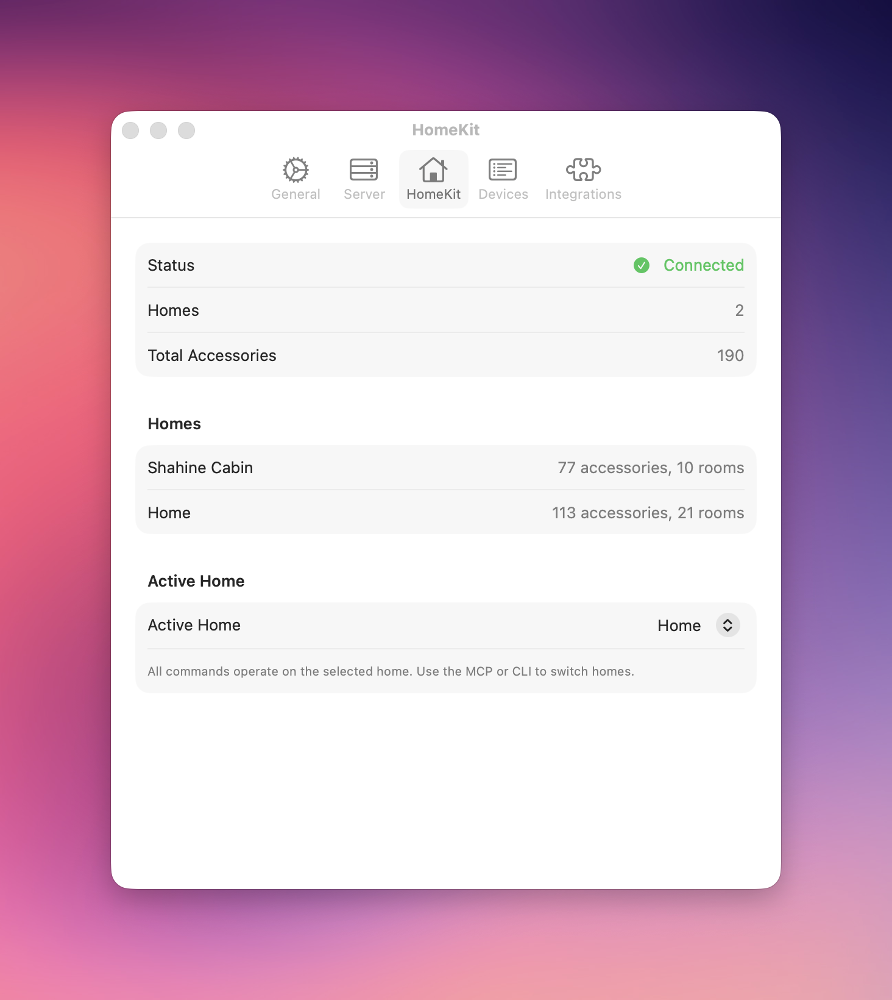
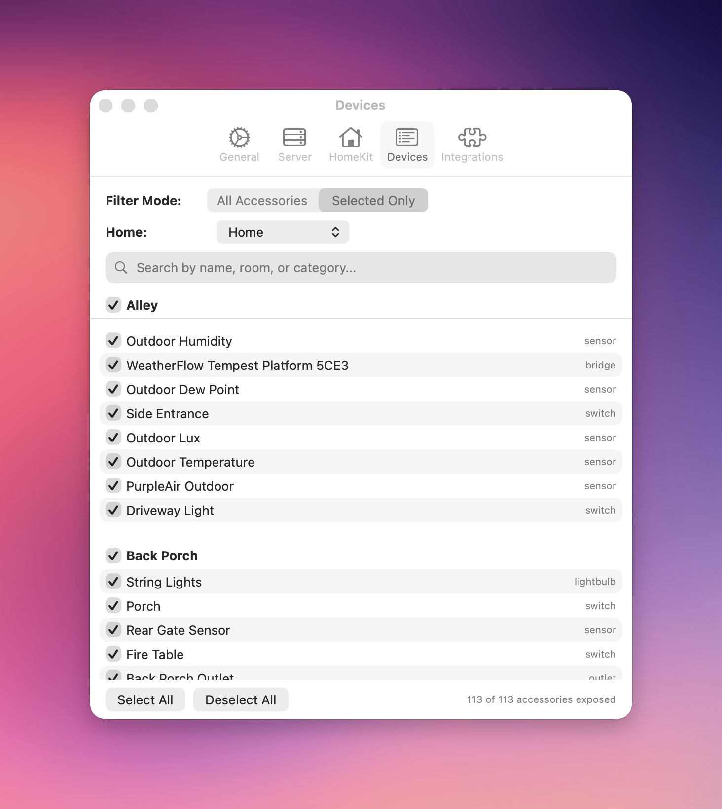
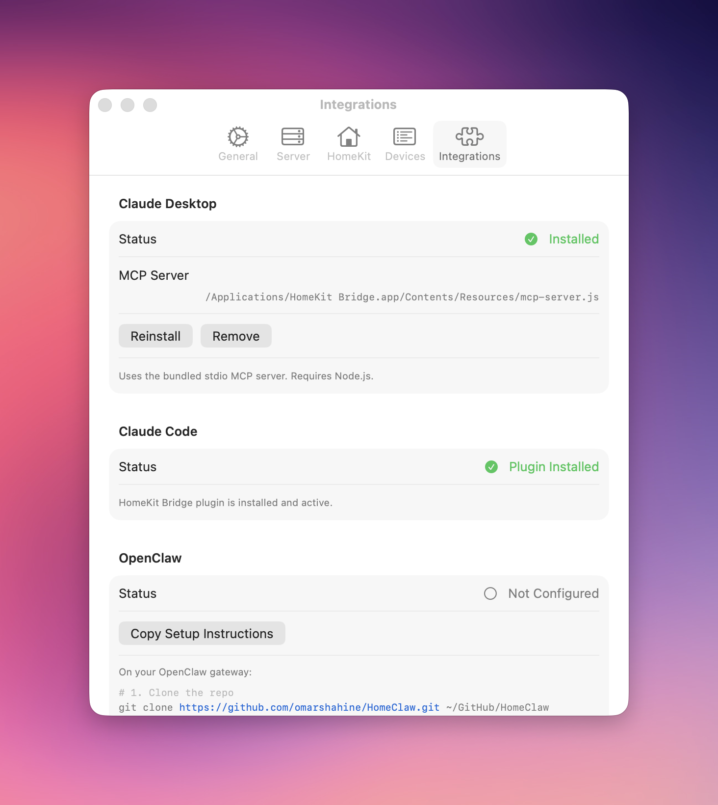

<p align="center"></p>

# HomeClaw

Control your Apple HomeKit smart home from AI assistants, the terminal, and automation tools.

HomeClaw exposes your HomeKit accessories through a **command-line tool**, a **stdio MCP server**, and plugins for **Claude Code** and **OpenClaw**. It runs as a lightweight macOS menu bar app.

## Why HomeClaw?

Apple HomeKit has no public API, no CLI, and no way to integrate with AI assistants or automation pipelines. HomeClaw bridges that gap with a development-signed macOS app that talks to HomeKit on your behalf and exposes a clean API surface.

- Ask Claude or OpenClaw to "turn off all the lights" or "set the thermostat to 72"
- Script your smart home from the terminal
- Build automations that go beyond what the Home app offers
- Search and control devices by name, room, category, or semantic type

## Architecture

```
Claude Code → Plugin (.claude-plugin/) → stdio MCP server (Node.js) ─┐
Claude Desktop → stdio MCP server (Node.js) ─────────────────────────┤
OpenClaw → Plugin (openclaw/) → homekit-cli ─────────────────────────┤
                                                                     ▼
                                              /tmp/homekit-bridge.sock
                                                                     │
                                              HomeKitHelper (Mac Catalyst, headless)
                                                ├── HMHomeManager (Apple HomeKit framework)
                                                └── Unix socket server

homekit-mcp (SwiftUI menu bar app)
    ├── Menu bar UI + Settings window
    ├── HelperManager (launches & monitors HomeKitHelper)
    └── Unix socket client (HomeKitClient)
```

**Why two processes?** Apple's `HMHomeManager` requires a UIKit/Catalyst app with the HomeKit entitlement and a valid provisioning profile. Plain Swift CLI/SPM apps cannot access HomeKit. The main app handles UI and helper lifecycle; the helper handles HomeKit. They communicate over a Unix domain socket with JSON newline-delimited messages.

## Quick Start

### Prerequisites

- macOS 26 (Tahoe) or later
- Xcode 26+ with Swift 6.2
- [XcodeGen](https://github.com/yonaskolb/XcodeGen): `brew install xcodegen`
- Node.js 20+ (for the MCP server wrapper)
- **Apple Developer account** with HomeKit capability enabled

> **Why is a developer account required?** Apple does not provide a public HomeKit API for macOS. The only way to access HomeKit is through `HMHomeManager`, which requires the `com.apple.developer.homekit` entitlement and a provisioning profile that covers your Mac's hardware UDID. Apple restricts this entitlement to development signing and App Store distribution -- it cannot be included in Developer ID (notarized) builds. This means every Mac that runs HomeClaw must be registered as a development device in your Apple Developer portal, and the app must be built with your team's signing identity. There is no way around this; it's an Apple platform restriction, not a HomeClaw limitation.

### Setup

```bash
git clone https://github.com/omarshahine/HomeClaw.git
cd HomeClaw

# Configure your Apple Developer Team ID (one-time setup)
echo "HOMEKIT_TEAM_ID=YOUR_TEAM_ID" > .env.local

# Generate the HomeKitHelper Xcode project
cd Sources/HomeKitHelper && xcodegen && cd ../..

# Install Node.js dependencies
npm install

# Build everything and install
scripts/build.sh --release --install
```

Find your Team ID at [developer.apple.com/account](https://developer.apple.com/account) under Membership Details.

Launch from `/Applications` or: `open "/Applications/HomeKit Bridge.app"`

On first launch, grant HomeKit access when prompted. The menu bar icon appears -- click it to see your connected homes.

> **Note:** Apple restricts the HomeKit entitlement to development signing and App Store distribution. Developer ID builds cannot access HomeKit. See [Why Development Signing?](#why-development-signing) for details.

## MCP Tools

The stdio MCP server wraps `homekit-cli` and exposes these tools:

| Tool | Description |
|------|-------------|
| `homekit_status` | Check bridge connectivity and accessory count |
| `homekit_accessories` | List, get details, search, or control accessories |
| `homekit_rooms` | List rooms and their accessories |
| `homekit_scenes` | List or trigger scenes |
| `homekit_device_map` | LLM-optimized device map with semantic types and aliases |
| `homekit_config` | View or update configuration (set active home, filtering) |

### Connecting an MCP Client

Any MCP-compatible client can connect via the **stdio server**, which wraps `homekit-cli` and requires no authentication (the HomeKit Bridge app must be running for the socket). Add this to your MCP client config (e.g. `claude_desktop_config.json`):

```json
{
  "mcpServers": {
    "homekit-bridge": {
      "command": "node",
      "args": ["/Applications/HomeKit Bridge.app/Contents/Resources/mcp-server.js"]
    }
  }
}
```

The `mcp-server.js` is bundled inside the app. You can also use the Integrations tab in Settings to install this automatically.

## CLI

The `homekit-cli` command-line tool communicates directly over the Unix domain socket. All read commands support `--json` for machine-readable output.

```bash
# List accessories
homekit-cli list
homekit-cli list --room "Kitchen"
homekit-cli list --category thermostat

# Control devices
homekit-cli set "Living Room Light" brightness 75
homekit-cli set "Front Door Lock" lock_target_state locked
homekit-cli set "Thermostat" target_temperature 72

# Get detailed device info
homekit-cli get "Kitchen Light" --json

# Search across all homes
homekit-cli search "bedroom" --category lightbulb

# Scenes
homekit-cli scenes
homekit-cli trigger "Good Night"

# LLM-optimized device map
homekit-cli device-map

# Status and configuration
homekit-cli status
homekit-cli config --default-home "Main House"
homekit-cli config --filter-mode allowlist
homekit-cli config --list-devices
```

## Using with Claude Code

HomeClaw integrates with [Claude Code](https://docs.anthropic.com/en/docs/claude-code) as a **plugin** that provides MCP tools and a HomeKit skill for richer natural language understanding.

### Installing the Plugin

Install from a local clone or directly from GitHub.

**From a local clone:**

```bash
# Clone if you haven't already
git clone https://github.com/omarshahine/HomeClaw.git ~/GitHub/HomeClaw

# Inside Claude Code, register the marketplace and install
/plugin marketplace add ~/GitHub/HomeClaw
/plugin install homekit-bridge@homekit-bridge
```

**From GitHub (no local clone needed):**

```bash
# Inside Claude Code, add the GitHub repo as a marketplace
/plugin marketplace add https://github.com/omarshahine/HomeClaw

# Install the plugin
/plugin install homekit-bridge@homekit-bridge
```

After installing, restart Claude Code. Then just ask:

> "Turn on the kitchen lights and set them to 50% brightness"
> "Lock all the doors"
> "What's the thermostat set to?"
> "Run the movie time scene"
> "Which lights are on in the living room?"

### Verifying the Connection

After installing, verify Claude can reach HomeKit:

```bash
# Check MCP server status inside Claude Code
/mcp
```

## Using with OpenClaw

HomeClaw includes an [OpenClaw](https://openclaw.ai) plugin that registers HomeKit tools on the gateway. Since OpenClaw typically runs on a remote machine, setup requires cloning the repo and configuring the plugin on your gateway.

### Gateway Setup

On your OpenClaw gateway:

```bash
# Clone the repo
git clone https://github.com/omarshahine/HomeClaw.git ~/GitHub/HomeClaw
```

Add the plugin to your `openclaw.json`:

```json5
{
  plugins: {
    allow: ["homeclaw"],
    load: { paths: ["~/GitHub/HomeClaw/openclaw"] },
    entries: {
      homeclaw: { enabled: true }
    }
  }
}
```

Restart the gateway to load the plugin. The plugin discovers `homekit-cli` via standard paths (`/usr/local/bin/homekit-cli`, `~/.local/bin/`, build output directories).

> **Note:** The `homekit-cli` binary must be accessible from the gateway, and the HomeKit Bridge app must be running on a Mac reachable via the Unix socket at `/tmp/homekit-bridge.sock`.

The Integrations tab in Settings detects the plugin status by reading your local `~/.openclaw/openclaw.json` config.

## Supported Accessories

HomeClaw supports the full range of HomeKit accessory categories:

| Category | Controllable Characteristics |
|----------|------------------------------|
| **Lights** | power, brightness (0-100), hue (0-360), saturation (0-100), color temperature (140-500 mireds) |
| **Thermostats** | target temperature, HVAC mode (off/heat/cool/auto), target humidity |
| **Locks** | lock/unlock (accepts `locked`, `unlocked`, `0`, `1`) |
| **Doors & Garage Doors** | open/close, obstruction detection (read-only) |
| **Fans** | active, rotation speed, rotation direction, swing mode |
| **Window Coverings** | target position (0-100%) |
| **Switches & Outlets** | power on/off |
| **Sensors** | motion, contact, temperature, humidity, light level, battery (all read-only) |
| **Scenes** | trigger by name or UUID |

## Menu Bar App

The menu bar provides at-a-glance status and quick actions:

- **HomeKit connection status** -- shows home names (green), or error states with reasons
- **Restart helper** -- manual restart when things go wrong, with auto-restart tracking
- **Settings** link and **Quit**

## Settings

Four configuration tabs accessible from the menu bar:

| Tab | Features |
|-----|----------|
| **General** | Launch at Login toggle, app version display |
| **HomeKit** | Connection status, home list with accessory and room counts, active home selector |
| **Devices** | Filter mode (all/allowlist), per-device toggles grouped by room, search, bulk select/deselect |
| **Integrations** | One-click install for Claude Desktop, Claude Code plugin detection, OpenClaw gateway setup |

### HomeKit

View connection status, browse your homes, and select which home is active for all MCP and CLI commands.

<p align="center"></p>

### Devices

Control which accessories are exposed to MCP clients and the CLI. Switch between **All Accessories** (everything visible) and **Selected Only** (allowlist mode). Accessories are grouped by room with a search filter and room-level toggles for quick bulk selection.

<p align="center"></p>

### Integrations

Install and manage connections to AI assistants. The app detects existing configurations and guides you through setup:

- **Claude Desktop** -- one-click install of the bundled stdio MCP server (requires Node.js)
- **Claude Code** -- detects the installed plugin (`homekit-bridge@homekit-bridge`)
- **OpenClaw** -- detects plugin configuration on the remote gateway and provides setup instructions

<p align="center"></p>

## Device Filtering

Use the [Devices tab](#devices) in Settings or the CLI to control which accessories are exposed:

```bash
homekit-cli config --filter-mode allowlist
homekit-cli config --allow-accessories "uuid1,uuid2,uuid3"
homekit-cli config --list-devices  # shows allowed/filtered status
```

Config stored at `~/.config/homekit-bridge/config.json`.

## Helper Process Management

The HomeKitHelper runs as a background process with automatic lifecycle management:

- **Health monitoring** -- polls every 30 seconds with 5-second timeout
- **Auto-restart** -- up to 5 restarts per 15-minute window (budget resets automatically)
- **State reporting** -- menu bar shows: starting, connected (with home names), helper down, or HomeKit unavailable (with reason)
- **Manual restart** -- button appears in menu bar when helper is down, even after auto-restarts are exhausted
- **Diagnostics** -- clear error states for missing entitlements, TCC permissions, or iCloud issues

## Building

The build script requires your Apple Developer Team ID, provided via `.env.local`, `--team-id`, or the `HOMEKIT_TEAM_ID` environment variable:

```bash
# Full release build + install to /Applications
scripts/build.sh --release --install

# Override team ID on the command line
scripts/build.sh --release --install --team-id ABCDE12345

# Debug build (faster)
scripts/build.sh --debug

# Skip HomeKitHelper for fast SPM-only iteration
scripts/build.sh --debug --skip-helper

# Clean build artifacts first
scripts/build.sh --clean
```

The build script handles: SPM compilation, Catalyst xcodebuild with automatic signing, app bundle assembly, code signing, and install.

### Version Bumping

Version is derived from git tags at build time. To release a new version:

```bash
scripts/bump-version.sh 0.2.0   # Updates source files + prints tag commands
npm run build:mcp                # Rebuild MCP server with new version
git add -A && git commit -m "Bump version to 0.2.0"
git tag -a v0.2.0 -m "HomeKit Bridge v0.2.0"
git push && git push origin v0.2.0
```

The build script reads the latest `v*` tag for the marketing version and uses commit count as the build number.

### Installing on Additional Macs

Development-signed builds are tied to registered devices. To run HomeClaw on another Mac:

1. **Get the target Mac's Provisioning UDID** -- on that Mac, run:
   ```bash
   system_profiler SPHardwareDataType | grep "Provisioning UDID"
   ```

2. **Register the device** at [developer.apple.com/account/resources/devices/add](https://developer.apple.com/account/resources/devices/add):
   - **Platform**: macOS
   - **Device Name**: a descriptive name (e.g. "Living Room MacBook Air")
   - **Device ID**: the Provisioning UDID from step 1

3. **Rebuild** on your development machine (Xcode regenerates the provisioning profile to include the new device):
   ```bash
   scripts/build.sh --release --install --clean
   ```

4. **Copy** `/Applications/HomeKit Bridge.app` to the target Mac (AirDrop, USB, network share, etc.)

5. **Grant HomeKit access** on first launch when prompted.

> **Note:** The target Mac must be signed into iCloud with an account that has HomeKit home data. HomeKit homes are tied to iCloud accounts, not to the app.

### Why Development Signing?

Apple restricts the `com.apple.developer.homekit` entitlement to **development signing** and **Mac App Store** distribution. It cannot be included in Developer ID provisioning profiles. A Developer ID build would pass Gatekeeper but have no HomeKit access (`HMHomeManager` returns zero homes). This is an [Apple platform restriction](https://developer.apple.com/forums/thread/699085), not a bug.

## Project Structure

```
Sources/
  homekit-mcp/             Main app (SPM executable)
    App/                   SwiftUI entry, AppDelegate, HelperManager
    HomeKit/               HomeKitClient (socket client to helper)
    Views/                 MenuBarView, SettingsView
    Shared/                AppConfig, Logger
    MCP/_disabled/         Preserved HTTP MCP server code (not compiled)
    Shared/_disabled/      Preserved KeychainManager (not compiled)
  homekit-cli/             CLI tool (SPM executable)
    Commands/              list, get, set, search, scenes, status, config, device-map
    SocketClient.swift     Direct socket communication
  HomeKitHelper/           Catalyst helper app (Xcode project via XcodeGen)
    HomeKitManager.swift   HMHomeManager wrapper (@MainActor)
    HelperSocketServer.swift   Unix socket server (GCD)
    CharacteristicMapper.swift HomeKit type mappings
    AccessoryModel.swift       JSON serialization models
Resources/                 Info.plist, entitlements, app icons
scripts/
  build.sh                 Build, sign, and install
  bump-version.sh          Update version across all 9 files
mcp-server/                Node.js stdio MCP server (wraps homekit-cli)
openclaw/                  OpenClaw plugin (HomeClaw)
  skills/homekit/          HomeKit skill with full characteristic reference
```

## Debugging

```bash
# Check if helper is running and HomeKit is ready
echo '{"command":"status"}' | nc -U /tmp/homekit-bridge.sock

# Verify HomeKit entitlement on installed app
codesign -d --entitlements - "/Applications/HomeKit Bridge.app/Contents/Helpers/HomeKitHelper.app"

# View HomeKitHelper logs
log show --predicate 'process == "HomeKitHelper"' --last 10m --style compact

# Check TCC (privacy) permissions
sqlite3 ~/Library/Application\ Support/com.apple.TCC/TCC.db \
  "SELECT client, auth_value FROM access WHERE service = 'kTCCServiceWillow'"
```

| Symptom | Cause | Fix |
|---------|-------|-----|
| 0 homes, `ready: false` | Missing HomeKit entitlement | Verify with `codesign -d --entitlements` |
| All characteristic values `nil` | Accessory unreachable | Check device power and network |
| Helper won't start | TCC permission not granted | Re-grant in System Settings > Privacy |
| "HomeKit Unavailable" in menu | iCloud not signed in | Sign into iCloud with HomeKit data |

## Tech Stack

- **Swift 6** with strict concurrency (`@MainActor`, `actor` isolation)
- **SwiftUI** for menu bar and settings UI
- **Mac Catalyst** for HomeKit framework access
- **[Swift Argument Parser](https://github.com/apple/swift-argument-parser)** for CLI
- **Node.js** + **[@modelcontextprotocol/sdk](https://github.com/modelcontextprotocol/typescript-sdk)** for stdio MCP server
- **XcodeGen** for HomeKitHelper project generation
- **GCD** + Unix domain sockets for IPC

## FAQ

### The helper won't start (error 162, "Launch failed")

This means macOS (AMFI) rejected the HomeKitHelper app at launch. The menu bar app automatically diagnoses the cause and shows it inline — look for the red "Helper Not Running" status with a reason underneath.

The most common causes:

**This Mac isn't in the provisioning profile.** Development-signed apps only run on Macs whose UDIDs are registered in the Apple Developer portal. The menu bar will show the unregistered UDID when this is the case. Fix: [register the device](#installing-on-additional-macs) and rebuild with `--clean`.

**Stale build artifacts.** After changing team IDs, updating Xcode, or modifying entitlements, cached signatures can cause mismatches:

```bash
scripts/build.sh --release --install --clean
```

**Missing provisioning profile.** If the `embedded.provisionprofile` file is missing from the helper bundle, Xcode automatic signing may have failed silently. Rebuild with `--clean` or open the HomeKitHelper project in Xcode to check signing status:

```bash
cd Sources/HomeKitHelper && xcodegen && open HomeKitHelper.xcodeproj
```

### `spctl --assess` says "rejected" — is that a problem?

No. `spctl` checks Gatekeeper, which only trusts Developer ID and App Store signing. HomeClaw uses **development signing** (required for HomeKit on macOS), so Gatekeeper will always reject it. This is expected and doesn't prevent the app from running — AMFI handles development-signed apps separately via the embedded provisioning profile.

### Can I use a different Apple ID for HomeKit than my developer account?

Yes. The two accounts serve completely different purposes:

- **Apple Developer account** — only matters at build time. Xcode uses it to create the provisioning profile and sign the code.
- **iCloud account** (on the Mac running HomeClaw) — determines which HomeKit homes appear. This is the account linked to your Home app data.

These are independent. You can build HomeClaw with your developer account and run it on a Mac signed into a completely different iCloud account that has HomeKit homes. The HomeKit data follows the iCloud account, not the signing identity.

### When should I use `--clean`?

Use `scripts/build.sh --clean` when:

- Switching Apple Developer Team IDs
- After major Xcode version updates
- Build fails with signing or entitlement errors
- HomeKitHelper previously worked but now won't launch (error 162)
- You see "Invalid code signature" in the menu bar diagnostic

The `--clean` flag removes all build artifacts — SPM's `.build/` directory, Xcode derived data, and the assembled app bundle — before building fresh. Without it, stale signed binaries or cached provisioning profiles from a previous team/identity can cause hard-to-debug launch failures.

### HomeKit shows 0 homes

The helper is running but can't see any HomeKit data. Check in order:

1. **iCloud signed in?** HomeKit data lives in iCloud. Open System Settings > Apple Account and verify.
2. **HomeKit entitlement present?** Run:
   ```bash
   codesign -d --entitlements :- "/Applications/HomeKit Bridge.app/Contents/Helpers/HomeKitHelper.app"
   ```
   You should see `com.apple.developer.homekit` → `true`.
3. **TCC permission granted?** On first launch, macOS asks for HomeKit access. If you denied it, re-grant in System Settings > Privacy & Security > HomeKit.
4. **Using Developer ID signing?** Only development signing supports the HomeKit entitlement. See [Why Development Signing?](#why-development-signing).

### How do I install on another Mac?

Development-signed apps are tied to registered devices. See [Installing on Additional Macs](#installing-on-additional-macs) for the full walkthrough, but the short version:

1. Get the target Mac's Provisioning UDID: `system_profiler SPHardwareDataType | grep "Provisioning UDID"`
2. Register it at [developer.apple.com](https://developer.apple.com/account/resources/devices/add) (Platform: macOS)
3. Rebuild with `--clean` on your dev machine (Xcode regenerates the profile to include the new device)
4. Copy `/Applications/HomeKit Bridge.app` to the target Mac
5. Grant HomeKit access on first launch

### How do I see what's happening?

```bash
# HomeKit Bridge app logs (includes helper launch diagnostics)
log show --predicate 'process == "homekit-mcp"' --last 10m --style compact

# HomeKitHelper logs
log show --predicate 'process == "HomeKitHelper"' --last 10m --style compact

# Check helper status directly over the socket
echo '{"command":"status"}' | nc -U /tmp/homekit-bridge.sock

# Verify code signature and entitlements
codesign -d --entitlements :- "/Applications/HomeKit Bridge.app/Contents/Helpers/HomeKitHelper.app"

# Check which devices are in the provisioning profile
security cms -D -i "/Applications/HomeKit Bridge.app/Contents/Helpers/HomeKitHelper.app/Contents/embedded.provisionprofile" 2>/dev/null | plutil -extract ProvisionedDevices json -o - -
```

## License

[MIT](LICENSE) -- Copyright (c) 2025 Omar Shahine
