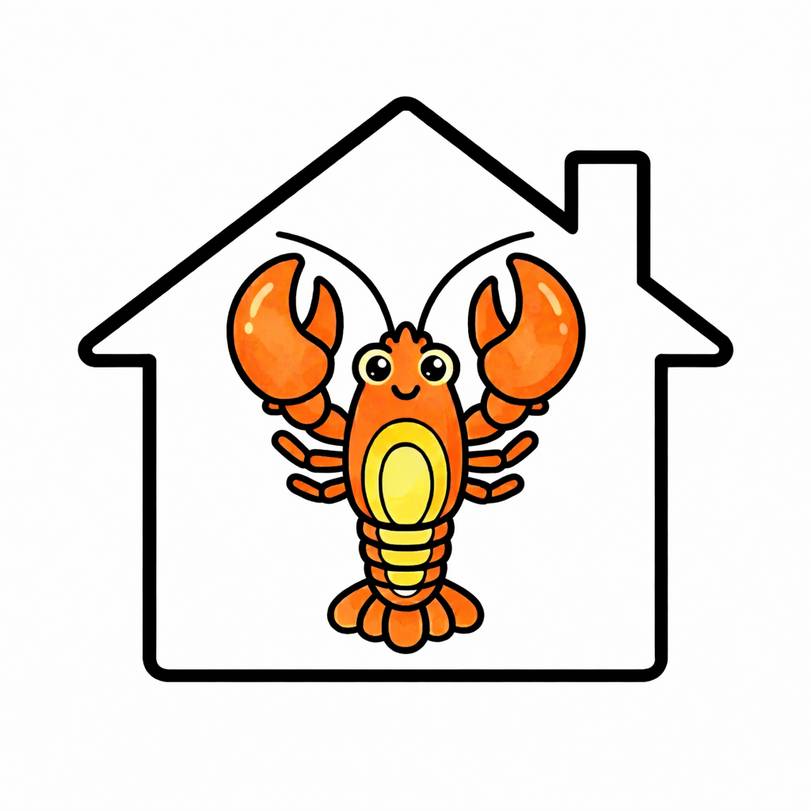
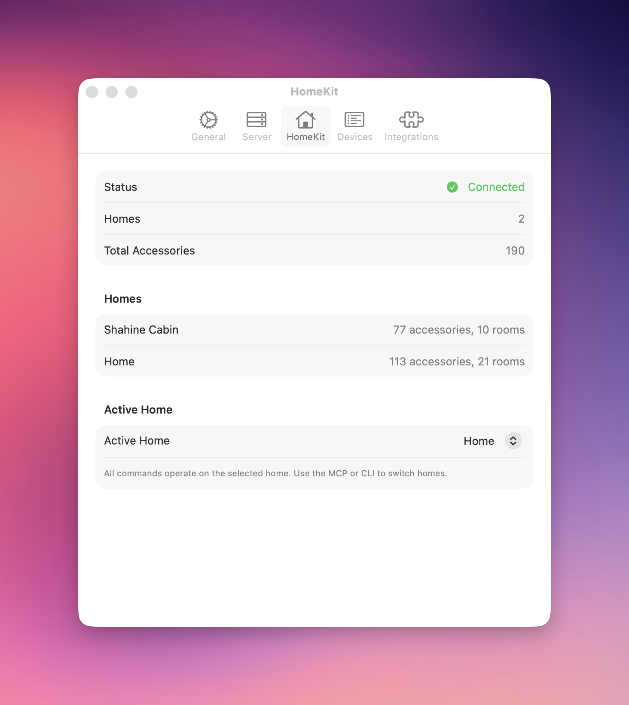
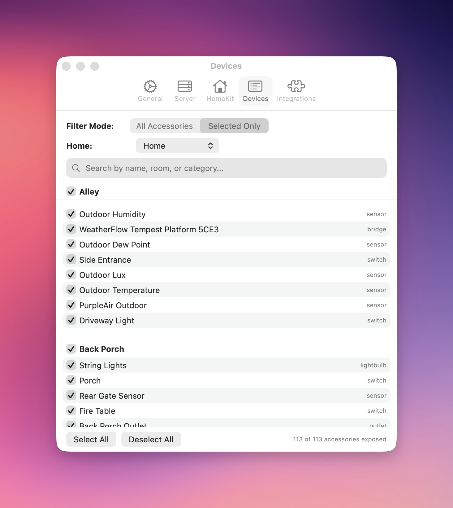
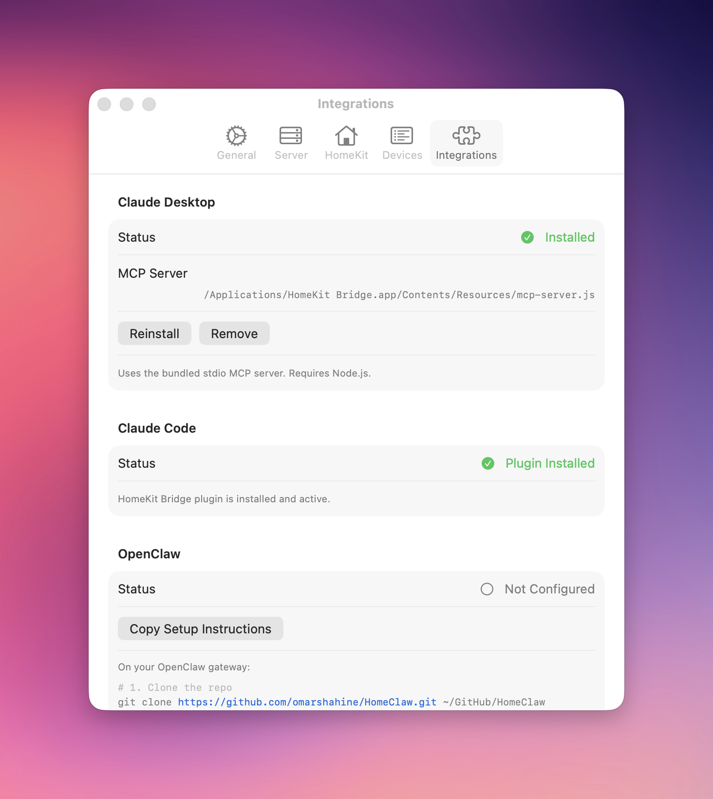

<p align="center"></p>

# HomeClaw

Control your Apple HomeKit smart home from AI assistants, the terminal, and automation tools.

HomeClaw exposes your HomeKit accessories through a **command-line tool**, a **stdio MCP server**, and plugins for **Claude Code** and **OpenClaw**. It runs as a lightweight macOS menu bar app.

## Why HomeClaw?

Apple HomeKit has no public API, no CLI, and no way to integrate with AI assistants or automation pipelines. HomeClaw bridges that gap with a Mac Catalyst app that talks to HomeKit on your behalf and exposes a clean API surface.

- Ask Claude or OpenClaw to "turn off all the lights" or "set the thermostat to 72"
- Script your smart home from the terminal
- Build automations that go beyond what the Home app offers
- Search and control devices by name, room, category, or semantic type

## Architecture

```
Claude Code --> Plugin (.claude-plugin/) --> stdio MCP server (Node.js) --+
Claude Desktop --> stdio MCP server (Node.js) ----------------------------+
OpenClaw --> Plugin (openclaw/) --> homeclaw-cli --------------------------+
                                                                          v
                                               Unix socket (JSON newline-delimited)
                                                                          |
                                               HomeClaw (Mac Catalyst app)
                                                 +-- HomeKitManager (direct, in-process)
                                                 +-- SocketServer (for CLI/MCP clients)
                                                 +-- macOSBridge.bundle (NSStatusItem menu bar)
```

**Single-process design.** Apple's `HMHomeManager` requires a UIKit/Catalyst app with the HomeKit entitlement. By making the entire app Catalyst, HomeKit access is direct (no IPC), signing is unified (single archive), and App Store submission is clean. The `macOSBridge` plugin bundle provides the native macOS menu bar via `NSStatusItem`.

## Install

### TestFlight (Recommended)

The easiest way to install HomeClaw is via TestFlight:

1. **[Join the TestFlight Beta](https://testflight.apple.com/join/zjSnz8eK)**
2. Install HomeClaw from TestFlight
3. Launch the app -- grant HomeKit access when prompted
4. The menu bar icon appears. Click it to see your connected homes.

TestFlight builds are signed for App Store distribution, so HomeKit works without any developer account setup.

Once running, set up your AI integrations:

- **[Claude Desktop](#connecting-an-mcp-client)** -- one-click install from Settings > Integrations, or add the MCP server config manually
- **[Claude Code](#using-with-claude-code)** -- install the plugin from GitHub
- **[OpenClaw](#using-with-openclaw)** -- one-click install from Settings > Integrations, or set up manually

### Build from Source

<details>
<summary>Prerequisites and setup for building from source</summary>

#### Prerequisites

- macOS 26 (Tahoe) or later
- Xcode 26+ with Swift 6.2
- [XcodeGen](https://github.com/yonaskolb/XcodeGen): `brew install xcodegen`
- Node.js 20+ (for the MCP server wrapper)
- **Apple Developer account** with HomeKit capability enabled

> **Why is a developer account required?** Apple does not provide a public HomeKit API for macOS. The only way to access HomeKit is through `HMHomeManager`, which requires the `com.apple.developer.homekit` entitlement and a provisioning profile that covers your Mac's hardware UDID. Apple restricts this entitlement to development signing and App Store distribution -- it cannot be included in Developer ID (notarized) builds. This means every Mac that runs HomeClaw must be registered as a development device in your Apple Developer portal, and the app must be built with your team's signing identity. There is no way around this; it's an Apple platform restriction, not a HomeClaw limitation.

#### Setup

```bash
git clone https://github.com/omarshahine/HomeClaw.git
cd HomeClaw

# Configure your Apple Developer Team ID (one-time setup)
echo "HOMEKIT_TEAM_ID=YOUR_TEAM_ID" > .env.local

# Install Node.js dependencies
npm install

# Build everything and install
scripts/build.sh --release --install
```

Find your Team ID at [developer.apple.com/account](https://developer.apple.com/account) under Membership Details.

Launch from `/Applications` or: `open "/Applications/HomeClaw.app"`

On first launch, grant HomeKit access when prompted. The menu bar icon appears -- click it to see your connected homes.

> **Note:** Apple restricts the HomeKit entitlement to development signing and App Store distribution. Developer ID builds cannot access HomeKit. See [Why Development Signing?](#why-development-signing) for details.

</details>

## MCP Tools

The stdio MCP server wraps `homeclaw-cli` and exposes these tools:

| Tool | Description |
|------|-------------|
| `homekit_status` | Check bridge connectivity and accessory count |
| `homekit_accessories` | List, get details, search, or control accessories |
| `homekit_rooms` | List rooms and their accessories |
| `homekit_scenes` | List, trigger, import, or delete scenes |
| `homekit_device_map` | LLM-optimized device map with semantic types and aliases |
| `homekit_events` | Query recent HomeKit events (characteristic changes, scene triggers, control actions) |
| `homekit_config` | View or update configuration (set active home, filtering) |

### Connecting an MCP Client

Any MCP-compatible client can connect via the **stdio server**, which wraps `homeclaw-cli` and requires no authentication (the HomeClaw app must be running for the socket). Add this to your MCP client config (e.g. `claude_desktop_config.json`):

```json
{
  "mcpServers": {
    "homeclaw": {
      "command": "node",
      "args": ["/Applications/HomeClaw.app/Contents/Resources/mcp-server.js"]
    }
  }
}
```

The `mcp-server.js` is bundled inside the app. You can also use the Integrations tab in Settings to install this automatically.

## CLI

The `homeclaw-cli` command-line tool communicates directly over the Unix domain socket. All read commands support `--json` for machine-readable output.

```bash
# List accessories
homeclaw-cli list
homeclaw-cli list --room "Kitchen"
homeclaw-cli list --category thermostat

# Control devices
homeclaw-cli set "Living Room Light" brightness 75
homeclaw-cli set "Front Door Lock" lock_target_state locked
homeclaw-cli set "Thermostat" target_temperature 72

# Get detailed device info
homeclaw-cli get "Kitchen Light" --json

# Search across all homes
homeclaw-cli search "bedroom" --category lightbulb

# Scenes
homeclaw-cli scenes
homeclaw-cli trigger "Good Night"

# Scene management
homeclaw-cli delete-scene "Old Scene"
homeclaw-cli import-scene scene.json --dry-run   # Preview before creating
homeclaw-cli import-scene scene.json              # Create scene from JSON
homeclaw-cli assign-rooms rooms.json --dry-run    # Preview room assignments
homeclaw-cli assign-rooms rooms.json              # Bulk-assign accessories to rooms

# LLM-optimized device map
homeclaw-cli device-map

# Status and configuration
homeclaw-cli status
homeclaw-cli config --default-home "Main House"
homeclaw-cli config --filter-mode allowlist
homeclaw-cli config --list-devices

# Event log
homeclaw-cli events                         # Recent events (last 50)
homeclaw-cli events --since 1h              # Events from the last hour
homeclaw-cli events --since 2d --json       # Last 2 days, JSON output
homeclaw-cli events --type scene_triggered  # Filter by event type

# Webhook configuration
homeclaw-cli config --webhook-url "http://127.0.0.1:18789"
homeclaw-cli config --webhook-token "your-secret-token"
homeclaw-cli config --webhook-enabled true
```

## Using with Claude Code

HomeClaw integrates with [Claude Code](https://docs.anthropic.com/en/docs/claude-code) as a **plugin** that provides MCP tools and a HomeKit skill for richer natural language understanding.

### Installing the Plugin

Install from a local clone or directly from GitHub.

**From a local clone:**

```bash
# Clone if you haven't already
git clone https://github.com/omarshahine/HomeClaw.git ~/GitHub/HomeClaw

# Inside Claude Code, register the marketplace and install
/plugin marketplace add ~/GitHub/HomeClaw
/plugin install homeclaw@homeclaw
```

**From GitHub (no local clone needed):**

```bash
# Inside Claude Code, add the GitHub repo as a marketplace
/plugin marketplace add https://github.com/omarshahine/HomeClaw

# Install the plugin
/plugin install homeclaw@homeclaw
```

After installing, restart Claude Code. Then just ask:

> "Turn on the kitchen lights and set them to 50% brightness"
> "Lock all the doors"
> "What's the thermostat set to?"
> "Run the movie time scene"
> "Which lights are on in the living room?"

### Verifying the Connection

After installing, verify Claude can reach HomeKit:

```bash
# Check MCP server status inside Claude Code
/mcp
```

## Using with OpenClaw

HomeClaw includes an [OpenClaw](https://openclaw.ai) plugin that registers a HomeKit skill on the gateway. The skill calls `homeclaw-cli` by name, so it must be in your PATH.

### Same-Mac Install (Recommended)

If HomeClaw and OpenClaw run on the same Mac, use the one-click installer:

1. Open **Settings > Integrations** and click **Install** in the OpenClaw section.

This handles all four steps automatically: installs the plugin, enables it, symlinks `homeclaw-cli` into your PATH, and restarts the gateway.

Or from the terminal:

```bash
# 1. Install the plugin from the bundled files
openclaw plugins install "/Applications/HomeClaw.app/Contents/Resources/openclaw/"
openclaw plugins enable homeclaw

# 2. Symlink the CLI into PATH (the skill calls homeclaw-cli by name)
# Apple Silicon (M1/M2/M3/M4):
ln -sf '/Applications/HomeClaw.app/Contents/MacOS/homeclaw-cli' /opt/homebrew/bin/homeclaw-cli
# Intel:
ln -sf '/Applications/HomeClaw.app/Contents/MacOS/homeclaw-cli' /usr/local/bin/homeclaw-cli

# 3. Restart the gateway to load the plugin
openclaw gateway restart
```

### Remote Gateway

If OpenClaw runs on a different machine:

```bash
# Clone the repo on the gateway
git clone https://github.com/omarshahine/HomeClaw.git ~/GitHub/HomeClaw

# Install the plugin
openclaw plugins install ~/GitHub/HomeClaw/openclaw
openclaw plugins enable homeclaw

# Symlink the CLI into PATH
ln -sf /path/to/homeclaw-cli /opt/homebrew/bin/homeclaw-cli

# Restart the gateway
openclaw gateway restart
```

> **Note:** The `homeclaw-cli` binary must be accessible from the gateway (in PATH), and the HomeClaw app must be running on the same Mac (connected via Unix socket).

## Supported Accessories

HomeClaw supports the full range of HomeKit accessory categories:

| Category | Controllable Characteristics |
|----------|------------------------------|
| **Lights** | power, brightness (0-100), hue (0-360), saturation (0-100), color temperature (140-500 mireds) |
| **Thermostats** | target temperature, HVAC mode (off/heat/cool/auto), target humidity |
| **Locks** | lock/unlock (accepts `locked`, `unlocked`, `0`, `1`) |
| **Doors & Garage Doors** | open/close, obstruction detection (read-only) |
| **Fans** | active, rotation speed, rotation direction, swing mode |
| **Window Coverings** | target position (0-100%) |
| **Switches & Outlets** | power on/off |
| **Sensors** | motion, contact, temperature, humidity, light level, battery (all read-only) |
| **Scenes** | trigger by name or UUID, import from JSON, delete by name |

### Scene Import Format

The `import-scene` command accepts a JSON file defining a scene and its actions:

```json
{
  "name": "Movie Night",
  "actions": [
    {"accessory": "Living Room Light", "room": "Living Room", "property": "brightness", "value": "30%"},
    {"accessory": "TV Backlight", "room": "Living Room", "property": "power_state", "value": "ON"},
    {"accessory": "Overhead", "room": "Living Room", "property": "power_state", "value": "OFF"}
  ]
}
```

The `assign-rooms` command accepts a JSON file mapping accessories to rooms:

```json
{
  "assignments": [
    {"accessory": "Kitchen Light", "room": "Kitchen"},
    {"accessory": "Desk Lamp", "room": "Office"}
  ]
}
```

Both commands support `--dry-run` to preview changes without modifying HomeKit.

## Menu Bar App

The menu bar provides at-a-glance status and quick actions:

- **HomeKit connection status** -- shows home names when connected, or error states with reasons
- **Launch at Login** toggle
- **Settings** link and **Quit**

## Settings

Five configuration tabs accessible from the menu bar:

| Tab | Features |
|-----|----------|
| **HomeKit** | Connection status, home list with accessory and room counts, active home selector |
| **Devices** | Filter mode (all/allowlist), per-device toggles grouped by room, search, bulk select/deselect |
| **Event Log** | Enable/disable event logging, configure file rotation (size limit + backup count), view storage stats, purge logs, reveal in Finder |
| **Webhook** | Configure webhook base URL + bearer token, select which scenes and accessories trigger webhooks using checkboxes grouped by room. Per-trigger delivery mode (Batched/Immediate) via segmented control. Agent routing available via CLI. Circuit breaker status banner when tripped. |
| **Integrations** | One-click install for Claude Desktop, Claude Code plugin detection, OpenClaw gateway setup |

### HomeKit

View connection status, browse your homes, and select which home is active for all MCP and CLI commands.

<p align="center"></p>

### Devices

Control which accessories are exposed to MCP clients and the CLI. Switch between **All Accessories** (everything visible) and **Selected Only** (allowlist mode). Accessories are grouped by room with a search filter and room-level toggles for quick bulk selection.

<p align="center"></p>

### Integrations

Install and manage connections to AI assistants. The app detects existing configurations and guides you through setup:

- **Claude Desktop** -- one-click install of the bundled stdio MCP server (requires Node.js)
- **Claude Code** -- detects the installed plugin (`homeclaw@homeclaw`)
- **OpenClaw** -- detects plugin configuration on the remote gateway and provides setup instructions

<p align="center"></p>

## Event Log

HomeClaw records all HomeKit events to a JSONL file in `~/Library/Application Support/HomeClaw/events.jsonl`. Events include characteristic changes (a light turned on), scene triggers, and control actions from the CLI or MCP.

### Configuration

Open **Settings > Event Log** to configure:

- **Enable/disable** event logging
- **Max file size** (10-500 MB) -- when the log reaches this size, it's rotated
- **Rotated backups** (0-10) -- how many old log files to keep before deleting the oldest
- **Purge** -- delete all event log files
- **Show in Finder** -- reveal the log directory

Or configure via CLI:

```bash
homeclaw-cli events                         # Show recent events
homeclaw-cli events --since 1h              # Last hour
homeclaw-cli events --type characteristic_change  # Filter by type
homeclaw-cli events --limit 200 --json      # JSON output
```

Event types: `characteristic_change`, `scene_triggered`, `accessory_controlled`, `homes_updated`

The `--since` flag accepts ISO 8601 timestamps or duration shorthand: `1h`, `30m`, `2d`.

## Webhook

HomeClaw can push HomeKit events to [OpenClaw](https://openclaw.ai) or any webhook-compatible service. Only accessories and scenes with **configured triggers** fire webhooks -- untriggered events are logged to disk but not pushed. Two endpoints are supported:

- **`/hooks/wake`** (default) -- text notification routed to a dedicated `hook:homeclaw` session. Best for ambient events: lights toggled, scenes triggered, temperature changes. Delivery is **batched** by default (`next-heartbeat`), or **immediate** (`now`) per trigger.
- **`/hooks/agent`** -- runs an isolated AI agent turn in its own `hook:<uuid>` session. Best for security events: door unlocked, garage opened, leak detected. Always immediate.

HomeClaw appends the endpoint path to your base URL automatically.

### Trigger Delivery Modes

Each trigger has a **delivery mode** that controls timing:

| Mode | Behavior | Set via |
|------|----------|---------|
| **Batched** (default) | Event queued until next heartbeat cycle | Settings UI segmented control |
| **Immediate** | Event delivered right away | Settings UI segmented control |
| **Agent** | Isolated AI agent turn, always immediate | Socket command only |

In **Settings > Webhook**, each enabled trigger shows a **Batched / Immediate** picker. Use Immediate for events you want to react to right away (scene triggers, door locks). Use Batched for ambient events (light toggles, temperature changes) to avoid noise.

Agent mode is configured via the socket for power users -- it routes to `/hooks/agent` instead of `/hooks/wake`.

### Setup with AI Assistant

Paste this prompt into **OpenClaw** or **Claude Code** to configure webhooks end-to-end:

> Set up HomeClaw webhooks to push HomeKit events to OpenClaw:
>
> **1. OpenClaw gateway config:**
> Add a `hooks` block to `~/.openclaw/openclaw.json`:
> ```json
> "hooks": {
>   "enabled": true,
>   "token": "${HOMECLAW_WEBHOOK_TOKEN}",
>   "defaultSessionKey": "hook:homeclaw",
>   "internal": { "enabled": true, "entries": { "audit-logger": { "enabled": true } } }
> }
> ```
> The `defaultSessionKey` routes wake events to a dedicated session (`hook:homeclaw`) so HomeKit noise doesn't pollute the main conversation.
> Add the token to `~/.openclaw/.env`:
> ```
> HOMECLAW_WEBHOOK_TOKEN=<generate-a-secure-token>
> ```
> The gateway hot-reloads `hooks.enabled` and `hooks.token`. Restart with `openclaw gateway restart` if `.env` wasn't loaded at process start.
>
> **2. HomeClaw config:**
> ```bash
> homeclaw-cli config --webhook-url "http://127.0.0.1:18789" \
>                     --webhook-token "<same-token-from-step-1>" \
>                     --webhook-enabled true
> ```
>
> **3. Create triggers:**
> Open HomeClaw Settings > Webhook. Check the scenes and accessories you want to generate webhook events. Start with security accessories (locks, garage doors, leak sensors) and a few lights to verify.
>
> **4. Test:**
> Toggle a light from the Home app. Verify a `System:` line appears in the OpenClaw TUI. Check `homeclaw-cli status --json` shows `circuit_state: closed` and a recent `last_success` timestamp.
>
> **5. (Optional) Upgrade security triggers to agent mode:**
> For door locks and leak sensors, upgrade the trigger to use `/hooks/agent` with `agent_deliver: true` so the AI analyzes the event and can alert you immediately.

### Manual Setup

<details>
<summary>Step-by-step without an AI assistant</summary>

#### 1. Configure OpenClaw

Add the `hooks` block to `~/.openclaw/openclaw.json`:

```json
"hooks": {
  "enabled": true,
  "token": "${HOMECLAW_WEBHOOK_TOKEN}",
  "defaultSessionKey": "hook:homeclaw",
  "internal": {
    "enabled": true,
    "entries": {
      "audit-logger": { "enabled": true }
    }
  }
}
```

The `defaultSessionKey` routes wake events to a dedicated `hook:homeclaw` session so HomeKit events don't pollute the main conversation.

Generate a token and add it to `~/.openclaw/.env`:

```bash
# Generate a secure token
openssl rand -base64 24 | tr '+/' '-_' | tr -d '='

# Add to .env
echo 'HOMECLAW_WEBHOOK_TOKEN=<your-generated-token>' >> ~/.openclaw/.env
```

Restart the gateway: `openclaw gateway restart`

#### 2. Configure HomeClaw

**Option A -- GUI:** Open Settings > Webhook. Toggle Enable, enter `http://127.0.0.1:18789` as the base URL, paste the same token from step 1. Click Generate if you need a new token (then update OpenClaw's `.env` to match).

**Option B -- CLI:**

```bash
homeclaw-cli config --webhook-url "http://127.0.0.1:18789" \
                    --webhook-token "your-token" \
                    --webhook-enabled true
```

#### 3. Create Triggers

In Settings > Webhook, check the accessories and scenes you want to fire webhooks. Only checked items generate events.

#### 4. Test

```bash
# Verify HomeClaw is connected and webhook is healthy
homeclaw-cli status

# Toggle a light from the Home app, then check events
homeclaw-cli events --since 5m

# Check HomeClaw delivery logs
log show --predicate 'process == "HomeClaw" AND category == "webhook"' --last 5m --style compact
```

</details>

### Wake vs Agent

| | `/hooks/wake` | `/hooks/agent` |
|---|---|---|
| **Purpose** | Notify the active session | Run an isolated AI agent turn |
| **Payload** | `{"text": "...", "mode": "next-heartbeat"}` | `{"message": "...", "name": "HomeClaw", "deliver": true}` |
| **Session** | Dedicated `hook:homeclaw` session | Separate `hook:<uuid>` per event |
| **Persistence** | Persistent session, accumulates events | Persisted in its own session |
| **Timeout** | 10 seconds | 30 seconds (for LLM inference) |
| **Use for** | Lights, scenes, temperature, ambient events | Door unlocks, leak sensors, security events |
| **AI analysis** | None -- just a notification | Full agent turn with context and tool access |

All triggers default to **wake**. Upgrade individual triggers to **agent** mode for events that need AI analysis:

```bash
# Via the HomeClaw socket (use nc or the CLI)
echo '{"command":"update_trigger","args":{
  "id":"<trigger-id>",
  "action":"agent",
  "agent_prompt":"The front door was unlocked. Check recent activity and alert me if unexpected.",
  "agent_name":"HomeClaw Security",
  "agent_deliver":true
}}' | nc -U ~/Library/Group\ Containers/group.com.shahine.homeclaw/homeclaw.sock
```

Set `agent_deliver: true` on security triggers -- this marks them as **critical**, meaning they bypass the circuit breaker and always attempt delivery even when the circuit is tripped.

### Circuit Breaker

The webhook system includes a **tiered circuit breaker** that prevents runaway delivery failures from hammering a down endpoint, while ensuring critical security events are never silently dropped.

| State | Trigger | Behavior | Recovery |
|-------|---------|----------|----------|
| **Normal** | -- | All webhooks delivered | -- |
| **Soft Open** | 5 consecutive failures | Non-critical paused | Auto-resumes after 5 minutes |
| **Hard Open** | 3 soft trips without any success | All non-critical stopped | Toggle webhook off→on in Settings |

**Critical triggers** (`agent_deliver: true`) always attempt delivery regardless of circuit state.

The circuit state is visible in:
- **Menu bar** -- warning icon when paused or disabled
- **Settings > Webhook** -- orange (paused) or red (disabled) banner with countdown
- **CLI** -- `homeclaw-cli status` shows circuit state, dropped count, and recovery hint

### How Events Flow

```
Home app / physical device / Siri
        │
        ▼
HomeKit (HMAccessoryDelegate callback)
        │
        ▼
HomeClaw event logger (writes to events.jsonl)
        │
        ├── Trigger matches? ──► POST /hooks/wake or /hooks/agent
        │
        └── No trigger ──► Logged to disk only (no webhook sent)

        ▼  (trigger matched)
OpenClaw gateway validates Bearer token
        │
        ├── /hooks/wake ──► hook:homeclaw session (dedicated, persistent)
        └── /hooks/agent ──► Isolated agent turn in hook:<uuid> session
```

### Authentication

Uses `Authorization: Bearer <token>` with idempotency headers (`X-Request-ID`, `X-Event-Timestamp`). See [SKILL.md](openclaw/skills/homekit/SKILL.md) for the full trigger fields reference, common patterns, and troubleshooting.

## Device Filtering

Use the [Devices tab](#devices) in Settings or the CLI to control which accessories are exposed:

```bash
homeclaw-cli config --filter-mode allowlist
homeclaw-cli config --allow-accessories "uuid1,uuid2,uuid3"
homeclaw-cli config --list-devices  # shows allowed/filtered status
```

## Building

The build script uses XcodeGen to generate the Xcode project and `xcodebuild` to compile all targets (HomeClaw Catalyst app, macOSBridge bundle, homeclaw-cli tool):

```bash
# Full release build + install to /Applications
scripts/build.sh --release --install

# Override team ID on the command line
scripts/build.sh --release --install --team-id ABCDE12345

# Debug build (faster)
scripts/build.sh --debug

# Clean build artifacts first
scripts/build.sh --clean
```

Your Apple Developer Team ID is required, provided via `.env.local`, `--team-id`, or the `HOMEKIT_TEAM_ID` environment variable.

### Archiving for App Store / TestFlight

```bash
scripts/archive.sh
# Then open in Xcode Organizer to distribute:
open '.build/archives/HomeClaw.xcarchive'
```

### Version Bumping

Version is derived from git tags at build time. To release a new version:

```bash
scripts/bump-version.sh 0.2.0   # Updates source files + prints tag commands
npm run build:mcp                # Rebuild MCP server with new version
git add -A && git commit -m "Bump version to 0.2.0"
git tag -a v0.2.0 -m "HomeClaw v0.2.0"
git push && git push origin v0.2.0
```

### Installing on Additional Macs

Development-signed builds are tied to registered devices. To run HomeClaw on another Mac:

1. **Get the target Mac's Provisioning UDID** -- on that Mac, run:
   ```bash
   system_profiler SPHardwareDataType | grep "Provisioning UDID"
   ```

2. **Register the device** at [developer.apple.com/account/resources/devices/add](https://developer.apple.com/account/resources/devices/add):
   - **Platform**: macOS
   - **Device Name**: a descriptive name (e.g. "Living Room MacBook Air")
   - **Device ID**: the Provisioning UDID from step 1

3. **Rebuild** on your development machine (Xcode regenerates the provisioning profile to include the new device):
   ```bash
   scripts/build.sh --release --install --clean
   ```

4. **Copy** `/Applications/HomeClaw.app` to the target Mac (AirDrop, USB, network share, etc.)

5. **Grant HomeKit access** on first launch when prompted.

> **Note:** The target Mac must be signed into iCloud with an account that has HomeKit home data. HomeKit homes are tied to iCloud accounts, not to the app.

### Why Development Signing?

Apple restricts the `com.apple.developer.homekit` entitlement to **development signing** and **Mac App Store** distribution. It cannot be included in Developer ID provisioning profiles. A Developer ID build would pass Gatekeeper but have no HomeKit access (`HMHomeManager` returns zero homes). This is an [Apple platform restriction](https://developer.apple.com/forums/thread/699085), not a bug.

## Project Structure

```
Sources/
  homeclaw/                Unified Catalyst app (Xcode target via XcodeGen)
    App/                   UIApplicationDelegate entry point, scene delegates
    Bridge/                BridgeProtocols.swift (Mac2iOS, iOS2Mac)
    HomeKit/               HomeKitManager, SocketServer, CharacteristicMapper,
                           AccessoryModel, DeviceMap, CharacteristicCache,
                           HomeEventLogger, WebhookCircuitBreaker
    Views/                 SettingsView, IntegrationsSettingsView
    Shared/                AppConfig, AppLogger, HomeClawConfig
  macOSBridge/             AppKit bundle (NSStatusItem menu bar)
    MacOSController.swift  NSStatusItem + NSMenu via iOS2Mac protocol
    Info.plist             NSPrincipalClass: MacOSController
  homeclaw-cli/            CLI tool (SPM executable + Xcode target)
    Commands/              list, get, set, search, scenes, status, config, device-map, events,
                           delete-scene, import-scene, assign-rooms
    SocketClient.swift     Direct socket communication
Resources/                 Info.plist, entitlements, app icons
scripts/
  build.sh                 Build, sign, and install
  archive.sh               Archive for App Store / TestFlight
  bump-version.sh          Update version across source files
mcp-server/                Node.js stdio MCP server (wraps homeclaw-cli)
openclaw/                  OpenClaw plugin (HomeClaw)
  skills/homekit/          HomeKit skill with full characteristic reference

App bundle layout (after build):
  Contents/MacOS/HomeClaw              Catalyst app executable
  Contents/MacOS/homeclaw-cli          Bundled CLI binary
  Contents/Resources/macOSBridge.bundle  AppKit menu bar plugin
  Contents/Resources/mcp-server.js       Node.js stdio MCP server
  Contents/Resources/openclaw/           Bundled OpenClaw plugin files
```

## Debugging

```bash
# Check if HomeClaw is running and HomeKit is ready
echo '{"command":"status"}' | nc -U ~/Library/Group\ Containers/group.com.shahine.homeclaw/homeclaw.sock

# Or via the CLI
homeclaw-cli status

# Verify HomeKit entitlement on installed app
codesign -d --entitlements :- "/Applications/HomeClaw.app"

# View HomeClaw logs
log show --predicate 'process == "HomeClaw"' --last 10m --style compact

# Check TCC (privacy) permissions
sqlite3 ~/Library/Application\ Support/com.apple.TCC/TCC.db \
  "SELECT client, auth_value FROM access WHERE service = 'kTCCServiceWillow'"
```

| Symptom | Cause | Fix |
|---------|-------|-----|
| 0 homes, `ready: false` | Missing HomeKit entitlement | Verify with `codesign -d --entitlements` |
| All characteristic values `nil` | Accessory unreachable | Check device power and network |
| "HomeKit Unavailable" in menu | iCloud not signed in | Sign into iCloud with HomeKit data |
| CLI crashes with SIGTRAP | Missing bundle ID in sandbox | Rebuild with `CREATE_INFOPLIST_SECTION_IN_BINARY: YES` |

## Tech Stack

- **Swift 6** with strict concurrency (`@MainActor`, `actor` isolation)
- **Mac Catalyst** (UIKit) for HomeKit framework access
- **AppKit** (via macOSBridge bundle) for native menu bar
- **[Swift Argument Parser](https://github.com/apple/swift-argument-parser)** for CLI
- **Node.js** + **[@modelcontextprotocol/sdk](https://github.com/modelcontextprotocol/typescript-sdk)** for stdio MCP server
- **XcodeGen** for Xcode project generation
- **GCD** + Unix domain sockets for CLI/MCP communication

## FAQ

### `spctl --assess` says "rejected" -- is that a problem?

No. `spctl` checks Gatekeeper, which only trusts Developer ID and App Store signing. HomeClaw uses **development signing** (required for HomeKit on macOS), so Gatekeeper will always reject it. This is expected and doesn't prevent the app from running -- AMFI handles development-signed apps separately via the embedded provisioning profile.

### Can I use a different Apple ID for HomeKit than my developer account?

Yes. The two accounts serve completely different purposes:

- **Apple Developer account** -- only matters at build time. Xcode uses it to create the provisioning profile and sign the code.
- **iCloud account** (on the Mac running HomeClaw) -- determines which HomeKit homes appear. This is the account linked to your Home app data.

These are independent. You can build HomeClaw with your developer account and run it on a Mac signed into a completely different iCloud account that has HomeKit homes. The HomeKit data follows the iCloud account, not the signing identity.

### When should I use `--clean`?

Use `scripts/build.sh --clean` when:

- Switching Apple Developer Team IDs
- After major Xcode version updates
- Build fails with signing or entitlement errors
- You see code signature errors after rebuilding

The `--clean` flag removes all build artifacts before building fresh.

### HomeKit shows 0 homes

The app is running but can't see any HomeKit data. Check in order:

1. **iCloud signed in?** HomeKit data lives in iCloud. Open System Settings > Apple Account and verify.
2. **HomeKit entitlement present?** Run:
   ```bash
   codesign -d --entitlements :- "/Applications/HomeClaw.app"
   ```
   You should see `com.apple.developer.homekit` -> `true`.
3. **TCC permission granted?** On first launch, macOS asks for HomeKit access. If you denied it, re-grant in System Settings > Privacy & Security > HomeKit.
4. **Using Developer ID signing?** Only development signing supports the HomeKit entitlement. See [Why Development Signing?](#why-development-signing).

### How do I install on another Mac?

Development-signed apps are tied to registered devices. See [Installing on Additional Macs](#installing-on-additional-macs) for the full walkthrough.

### How do I see what's happening?

```bash
# HomeClaw app logs
log show --predicate 'process == "HomeClaw"' --last 10m --style compact

# Check HomeKit status directly over the socket
homeclaw-cli status

# Verify code signature and entitlements
codesign -d --entitlements :- "/Applications/HomeClaw.app"
```

## License

[MIT](LICENSE) -- Copyright (c) 2025 Omar Shahine
